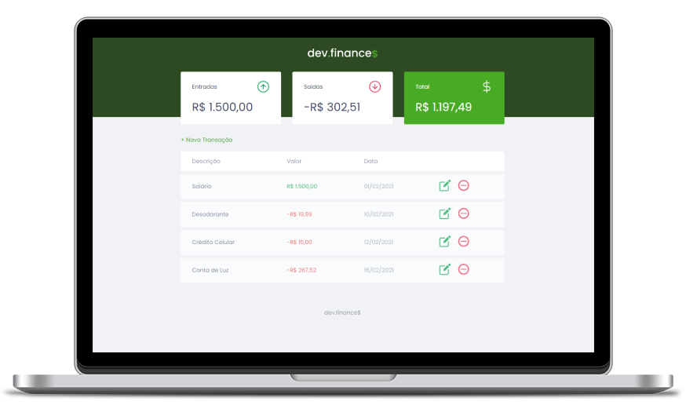

<h1 align="center">
  
</h1>

  <a href="#-tecnologias">Tecnologias</a>&nbsp;&nbsp;&nbsp;|&nbsp;&nbsp;&nbsp;
  <a href="#-projeto">Projeto</a>&nbsp;&nbsp;&nbsp;

 

  

## 🚀 Tecnologias

Esse projeto foi desenvolvido com as seguintes tecnologias:

- HTML
- CSS
- JavaScript

## 💻 Projeto

O dev.finances é uma aplicação de controle financeiro, onde é possível cadastrar, atualizar e excluir transações e ver o saldo de entrada e saída 💰

O projeto foi feito pela Rocketseat através da maratona discover onde tive a oportunidade de aprender ainda mais e assim pude colaborar com algumas funcionalidades a mais 😉

Alterações :

- Agora é possível alterar as transações.

Feito com ♥ by <a href="https://github.com/rocketseat-education">Rocketseat<a> e incrementado algumas funcionalidades por mim :wave:
